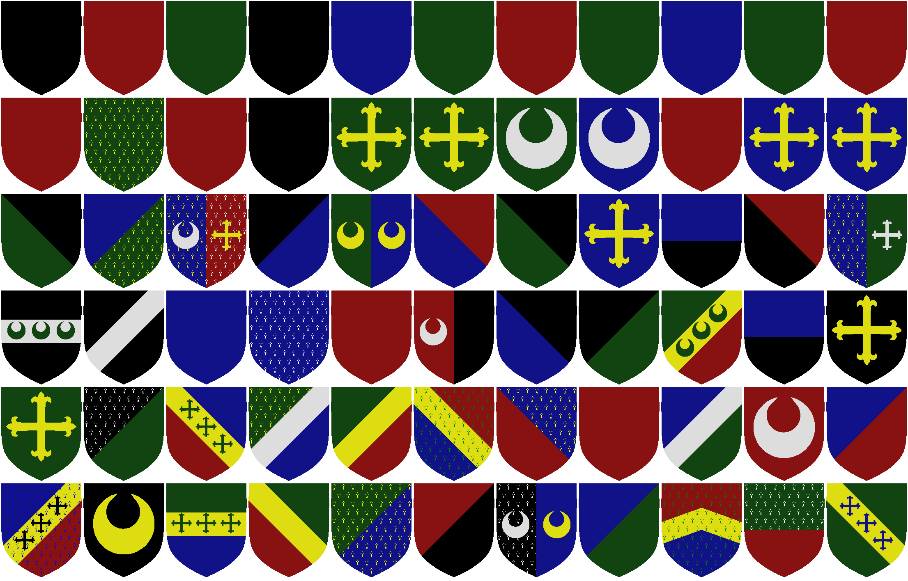

Peerage
=======

A quick and dirty coat of arms generator.

Run like
~~~
$ ruby Heraldry.rb
~~~
and the output will be in `output.png`.

This is very rough and tumble.  For example a lot of debug stuff will be printed to the comand line.  The resolution is not great (although you can render the svg in higher resolutions for higher resolution images).  There is a lot of work to be done if I (or you) want to use this for anything serious.

Sample output
-------------

Using the images
----------------

The images generated by this tool are in the public domain.  You may do with them as you will.